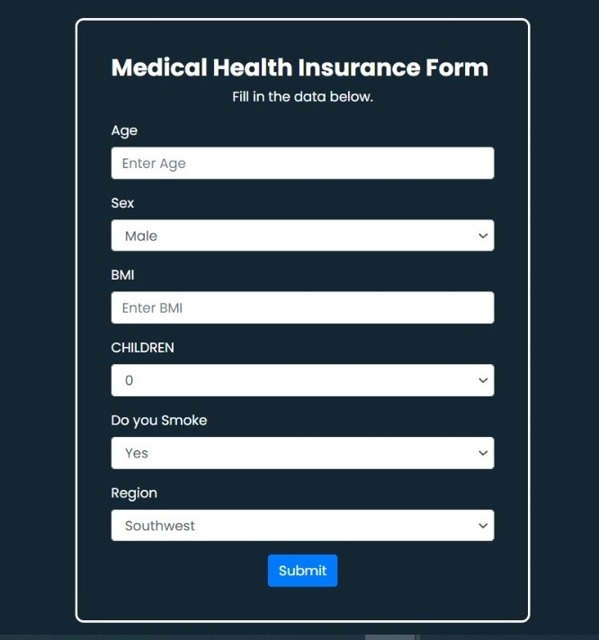

# Insurance-Charges-Prediction Using Linear Regression Model - Flask Web App
The Insurance-Charges-Prediction is a web application built with Flask that allows users to predict insurance charges using linear regression model.

## Introduction

Insurance Charges Prediction is a web application built with Flask that allows users to predict insurance charges based on different input parameters such as age, sex, BMI, etc. The application uses a Linear Regression Model trained on an insurance dataset to make predictions.

## Installation

1. Clone the repository:
   git clone https://github.com/dbandawane/Insurance-Charges-Prediction
3. Install the required packages:
   pip install -r requirements.txt
3. Start the Flask app:
   python interface.py

## Usage

1. Open your web browser and navigate to http://localhost:5050 to access the application.
   
2. On the homepage, enter the required details such as age, sex, BMI, etc.
3. Click the "Submit" button to see the predicted insurance charges.

## Features
- Predicts insurance charges based on user input using a Linear Regression Model.
- User-friendly web interface for entering information and obtaining predictions.

## Contributing

Contributions are welcome! If you find any bugs or have suggestions for improvements, feel free to open an issue or submit a pull request.
